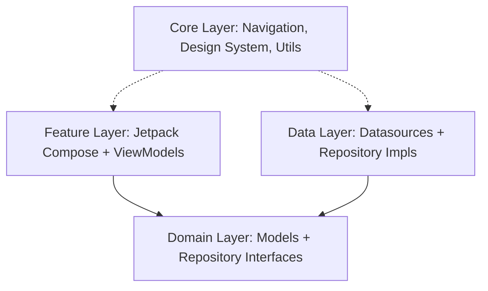

# Tài liệu Kiến trúc & Thiết kế Toàn bộ Ứng dụng FanZone

Tài liệu này cung cấp cái nhìn toàn diện về kiến trúc phần mềm, cấu trúc thư mục, luồng dữ liệu, cơ chế điều hướng, quản lý trạng thái, và các tính năng cốt lõi của ứng dụng Android **FanZone**.

---

## 1. Tổng quan ứng dụng
**FanZone** là ứng dụng di động dành cho người hâm mộ tham gia các sự kiện (thể thao, âm nhạc, giải trí). Ứng dụng cung cấp các dịch vụ:
* **Khám phá Sự kiện:** Tìm kiếm, lọc sự kiện theo danh mục và từ khóa.
* **Đặt vé & Chọn chỗ:** Quy trình đặt vé thời gian thực, chọn vị trí ghế ngồi, và thanh toán tích hợp qua cổng **VNPAY**.
* **Ví Vé (Ticket Wallet):** Quản lý các vé đã mua dưới dạng mã QR offline/online.
* **Cộng đồng (Community Feed):** Mạng xã hội thu nhỏ cho phép viết bài, chia sẻ bài viết, bình luận, yêu thích (Like), và theo dõi người dùng khác (Follow).
* **Trợ lý Ảo (Chatbot Support):** Hỗ trợ giải đáp thắc mắc tự động tích hợp media player.
* **Hệ thống Thông báo (Notifications):** Cập nhật thời gian thực về tương tác cộng đồng.

---

## 2. Kiến trúc phân lớp (Multi-layered Clean Architecture)
FanZone áp dụng nguyên lý **Clean Architecture** kết hợp phân chia theo **Feature** nhằm đảm bảo tính độc lập, dễ bảo trì và dễ mở rộng.



### 2.1. Lớp Domain (Domain Layer) - `com.example.myapplication.domain`
Là lõi của ứng dụng, chứa các quy tắc nghiệp vụ thuần túy của Kotlin. Lớp này không phụ thuộc vào bất kỳ thư viện Android hay Firebase UI nào.
* **`model/`:** Các thực thể dữ liệu nghiệp vụ: `Event`, `Ticket`, `CommunityPost`, `Notification`, `UserProfile`, `EventSeat`, `PaymentMethod`...
* **`repository/`:** Các Interface định nghĩa ranh giới giao tiếp dữ liệu. Các lớp UI/ViewModel sẽ giao tiếp với dữ liệu thông qua các interface này thay vì gọi trực tiếp database.

### 2.2. Lớp Dữ liệu (Data Layer) - `com.example.myapplication.data`
Cung cấp cài đặt cụ thể cho các Repository từ lớp Domain. Đây là nơi kết nối với các dịch vụ bên ngoài (Firebase, VNPAY, Local Cache).
* **`firebase/`:** Chứa các Datasource tương tác trực tiếp với SDK Firestore/Storage:
  * `CommunityFirestoreDataSource.kt`: Quản lý CRUD bài viết, bình luận, lượt thích, lượt chia sẻ.
  * `NotificationFirestoreDataSource.kt`: Lắng nghe thời gian thực và quản lý thông báo.
  * `CommunityStorageDataSource.kt`: Tải ảnh/video lên Firebase Storage.
  * `VnpayPaymentDataSource.kt`: Xử lý giao dịch với cổng thanh toán VNPAY.
* **`repository/`:** Triển khai các Interface Repository từ lớp Domain bằng cách điều phối dữ liệu từ các Datasource trên.

### 2.3. Lớp Giao diện & Tính năng (Feature Layer) - `com.example.myapplication.feature`
Chứa các màn hình hiển thị trực quan được phát triển bằng **Jetpack Compose** kết hợp với các **ViewModel** tương ứng quản lý trạng thái UI.

Ứng dụng bao gồm 11 module tính năng chính:
1. **`authentication`:** Đăng nhập, đăng ký, quên mật khẩu và đăng nhập Google.
2. **`home`:** Màn hình chính hiển thị danh sách sự kiện nổi bật và danh mục lựa chọn.
3. **`search`:** Tìm kiếm sự kiện thông minh tích hợp lịch sử tìm kiếm.
4. **`event`:** Chi tiết sự kiện, thông tin giá vé và điều hướng mua vé.
5. **`booking`:** Sơ đồ chọn chỗ ngồi thời gian thực.
6. **`checkout`:** Tổng hợp hóa đơn, lựa chọn phương thức thanh toán.
7. **`success`:** Màn hình xác nhận giao dịch thành công kèm thông tin vé.
8. **`community`:** Dòng thời gian cộng đồng chung và cộng đồng theo từng sự kiện.
9. **`profile`:** Quản lý trang cá nhân, người theo dõi, tùy chỉnh cài đặt và xem trang cá nhân khác.
10. **`tickets`:** Ví vé hiển thị các vé đã mua kèm mã QR.
11. **`support`:** Hỗ trợ trực tuyến thông qua Chatbot.

### 2.4. Lớp Cốt lõi (Core Layer) - `com.example.myapplication.core`
Cung cấp các thành phần dùng chung cho toàn bộ ứng dụng:
* **`designsystem/`:** Hệ thống Theme (Theme, Color, Typography) và các Component giao diện dùng chung như `CircleAvatar`, `DeleteConfirmDialog`, `LoginRequiredDialog`, `SectionHeader`.
* **`navigation/`:** Quản lý cấu trúc định tuyến và điều hướng.
* **`notification/`:** Các Helper quản lý hiển thị thông báo đẩy cục bộ (Local Notifications).
* **`util/`:** Các tiện ích chung xử lý chuỗi (`AppStrings`), định dạng thời gian.

---

## 3. Cơ chế điều hướng (Routing & Navigation)
Ứng dụng sử dụng **Jetpack Navigation Compose** với một NavHost tập trung là **`FanZoneNavHost`**:
* **`AppDestination`:** Định nghĩa các Route tĩnh và động (Dynamic Routes) dưới dạng các chuỗi URI duy nhất (ví dụ: `event_detail/{eventId}`, `event_community/{eventId}`).
* **`FanZoneNavHost.kt`:**
  * Định nghĩa cấu trúc đồ thị điều hướng (`composable()`).
  * Thực hiện thu thập (collect) trạng thái đăng nhập hệ thống để điều hướng thích hợp.
  * Kiểm tra các điều kiện an toàn trước khi chuyển màn hình (ví dụ: kiểm tra bài viết có tồn tại hay không trước khi nhảy từ trang thông báo đến chi tiết bài viết, hiển thị cảnh báo `Toast` nếu bài viết đã bị xóa).

---

## 4. Cơ chế quản lý trạng thái (State Management)
Ứng dụng sử dụng luồng dữ liệu **UDF (Unidirectional Data Flow)**:

```
[User Action] ---> [ViewModel] ---> [Repository] ---> [Firestore]
     ^                                                    |
     |                                                    v
[Collect State] <--- [Flow / StateFlow] <-----------------+
```

1. **ViewModels** giữ trạng thái dưới dạng `StateFlow<UiState>` sử dụng cấu trúc dữ liệu bất biến (Immutable Data Classes).
2. **UI Composables** đăng ký lắng nghe trạng thái bằng cách sử dụng `.collectAsStateWithLifecycle()` để tự động cập nhật lại giao diện (Recomposition) khi dữ liệu thay đổi.
3. Các hành động của người dùng (như Like, Comment, Đặt vé) được chuyển thành các lời gọi hàm lên ViewModel để cập nhật trạng thái.

---

## 5. Các luồng xử lý đặc biệt & Cơ chế tối ưu hóa

### 5.1. Luồng thanh toán cổng VNPAY
1. Người dùng chọn ghế và phương thức thanh toán tại `checkout`.
2. Ứng dụng gọi `VnpayPaymentDataSource` gửi request giao dịch lên backend để nhận URL thanh toán VNPAY.
3. Ứng dụng mở một WebView hoặc chuyển hướng người dùng thực hiện thanh toán trên trang VNPAY.
4. Sau khi thanh toán, URL callback từ VNPAY được bắt và phân tích kết quả giao dịch.
5. Nếu giao dịch thành công, tạo bản ghi vé (`Ticket`) trên Firestore và chuyển hướng người dùng sang màn hình `success`.

### 5.2. Hệ thống thông báo thời gian thực & Tối ưu hóa ghi lô (Batch Write)
Hệ thống thông báo sử dụng Firestore Snapshot Listeners chạy ngầm để phát thông báo đẩy cục bộ ngay khi có bản ghi mới được tạo trên server.

Đối với các hành động như **Chia sẻ bài viết (Share Post)**, ứng dụng cần gửi thông báo đến nhiều người theo dõi (Followers) cùng lúc. Luồng này được tối ưu hóa như sau:
* **Ghi lô (Batch Write):** Thay vì gửi hàng chục request lẻ tẻ lên mạng, ứng dụng gom tất cả thông báo vào một danh sách và gửi duy nhất 1 request dạng lô (`firestore.batch()`) thông qua `createNotifications`, giúp giảm tải băng thông và hạn chế lỗi mất dữ liệu.
* **Coroutine không bị hủy (NonCancellable):** Tiến trình được bọc trong `viewModelScope.launch(Dispatchers.IO + NonCancellable)`. Thiết kế này đảm bảo kể cả khi người dùng nhấn thoát app hay tắt màn hình ngay sau khi click chia sẻ, tiến trình gửi thông báo dưới nền vẫn được đảm bảo hoàn thành 100%.

### 5.3. Bảo mật và Chế độ Khách (Guest Mode / Auth Guard)
* Ứng dụng cho phép người dùng chưa đăng nhập sử dụng ở chế độ khách (Guest Mode) để xem danh sách sự kiện và đọc bài viết cộng đồng.
* Đối với các tính năng yêu cầu định danh (Like, Comment, Share, xem thông báo, mua vé), ứng dụng áp dụng cơ chế chặn bằng cách hiển thị hộp thoại cảnh báo **`LoginRequiredDialog`** để nhắc nhở đăng nhập thay vì chuyển hướng đột ngột, nâng cao trải nghiệm người dùng.
