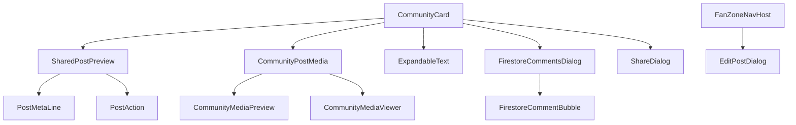

# Tài liệu Chi tiết các Thành phần Giao diện Cộng đồng (Community UI Components)

Tài liệu này cung cấp mô tả chi tiết, sơ đồ tham số, thiết kế và hành vi của từng thành phần giao diện người dùng (Jetpack Compose) thuộc gói [component](file:///c:/Users/quang/AndroidStudioProjects/MyApplication/app/src/main/java/com/example/myapplication/feature/community/component) của tính năng Cộng đồng trong ứng dụng FanZone.

> [!NOTE]
> Để hiểu rõ hơn về luồng kiến trúc MVVM, đồng bộ dữ liệu Firestore, hệ thống thông báo và chi tiết công nghệ sử dụng, vui lòng xem [Tài liệu Tổng quan Tính năng Cộng đồng](file:///c:/Users/quang/AndroidStudioProjects/MyApplication/docs/COMMUNITY_FEATURE.md).

---

## Sơ đồ Phụ thuộc Thành phần (Component Dependencies Diagram)

---

## Danh sách Chi tiết các Thành phần (UI Components List)

### 1. `CommunityCard` - [CommunityCard.kt](file:///c:/Users/quang/AndroidStudioProjects/MyApplication/app/src/main/java/com/example/myapplication/feature/community/component/CommunityCard.kt)
- **Mục đích**: Thành phần chính (Wrapper Component) để hiển thị một thẻ bài đăng hoàn chỉnh trên bảng tin. Component này tự động phân tích loại bài đăng để quyết định hiển thị bài đăng thông thường hay bài viết chia sẻ.
- **Tham số chính**:
  - `post: CommunityPost`: Đối tượng chứa dữ liệu bài đăng.
  - `currentUserId: String?`: ID của người dùng hiện tại đang đăng nhập.
  - `onSharePost`, `onToggleLike`, `onToggleFollow`, `onOpenComments`, `onAddComment`: Các callback tương tác hành động.
  - `onEditPost`: Được kích hoạt khi bấm nút chỉnh sửa.
  - `onDeletePost`: Được kích hoạt khi bấm nút xóa bài đăng.
- **Thiết kế**:
  - Giao diện thẻ phẳng, bo góc lớn `28.dp` trang nhã.
  - Tích hợp nút `MoreVert` (ba dấu chấm dọc) ở góc trên bên phải khi bài viết thuộc về chính người dùng đăng nhập (`isMyPost = true`), mở ra menu Dropdown có hai lựa chọn: "Chỉnh sửa" và "Xóa".

---

### 2. `SharedPostPreview` - [SharedPostPreview.kt](file:///c:/Users/quang/AndroidStudioProjects/MyApplication/app/src/main/java/com/example/myapplication/feature/community/component/SharedPostPreview.kt)
- **Mục đích**: Hiển thị bài đăng dưới dạng một bài chia sẻ (Reshared Post), bao gồm nội dung viết thêm của người chia sẻ ở trên và một khung thẻ con bo viền chứa thông tin của bài viết gốc ở dưới.
- **Tham số chính**:
  - `post: CommunityPost`: Bài viết bao bọc bên ngoài (chứa caption mới của người chia sẻ).
  - `share: SharedCommunityPost`: Dữ liệu ảnh chụp nhanh (snapshot) hoặc dữ liệu đồng bộ động của bài viết gốc ban đầu.
- **Xử lý đặc biệt**:
  - **Đồng bộ động**: Dữ liệu của bài viết gốc trong `share` được đồng bộ thời gian thực từ Firestore.
  - **Trạng thái bài viết gốc bị xóa (`share.isDeleted == true`)**: Khi phát hiện bài viết gốc không còn tồn tại, thẻ con bên trong sẽ tự động ẩn toàn bộ thông tin gốc và hiển thị một hộp cảnh báo bo góc màu xám nhạt (`Color(0xFFF8F9FA)`) với biểu tượng `Icons.Default.Campaign` cùng thông điệp: *"Nội dung này hiện không khả dụng"*.

---

### 3. `ExpandableText` - [ExpandableText.kt](file:///c:/Users/quang/AndroidStudioProjects/MyApplication/app/src/main/java/com/example/myapplication/feature/community/component/ExpandableText.kt)
- **Mục đích**: Hiển thị nội dung văn bản dài của bài viết kèm tính năng rút gọn thông minh.
- **Hành vi**:
  - Nếu độ dài văn bản vượt quá giới hạn kí tự (`textLimit`, mặc định là 50): Văn bản sẽ bị cắt bớt và hiển thị nút màu xanh lá cây **"Xem thêm"**.
  - Khi nhấn vào, văn bản sẽ bung ra toàn bộ và hiển thị nút **"Rút gọn"** để người dùng có thể thu nhỏ lại khi cần.

---

### 4. `CommunityPostMedia` - [CommunityPostMedia.kt](file:///c:/Users/quang/AndroidStudioProjects/MyApplication/app/src/main/java/com/example/myapplication/feature/community/component/CommunityPostMedia.kt)
- **Mục đích**: Bộ điều phối hiển thị hình ảnh và video đính kèm trong bài đăng.
- **Hành vi hiển thị**:
  - **1 phương tiện**: Sử dụng `CommunityMediaPreview` lớn lấp đầy chiều rộng với chiều cao tùy chỉnh.
  - **Nhiều phương tiện**: Sử dụng một danh sách cuộn ngang (`LazyRow`) với các preview có kích thước `280.dp x 300.dp`.
  - Nhấn vào bất kỳ ảnh/video nào sẽ hiển thị trình xem đa phương tiện phóng to (`CommunityMediaViewer`).

---

### 5. `CommunityMediaPreview` - [CommunityPostMedia.kt](file:///c:/Users/quang/AndroidStudioProjects/MyApplication/app/src/main/java/com/example/myapplication/feature/community/component/CommunityPostMedia.kt)
- **Mục đích**: Hiển thị ảnh thu nhỏ hoặc hình ảnh đại diện của video/audio đính kèm trước khi người dùng phóng to.
- **Nhận diện**:
  - Tự động hiển thị tài nguyên cục bộ hoặc URL từ xa thông qua `AsyncImage` (Coil).
  - Đối với video, hiển thị một lớp overlay với biểu tượng phát (`PlayCircle`).
  - Đối với audio, hiển thị biểu tượng micro (`Mic`).

---

### 6. `CommunityMediaViewer` - [CommunityPostMedia.kt](file:///c:/Users/quang/AndroidStudioProjects/MyApplication/app/src/main/java/com/example/myapplication/feature/community/component/CommunityPostMedia.kt)
- **Mục đích**: Trình xem đa phương tiện toàn màn hình (Full-screen media viewer) thông qua `Dialog`.
- **Tính năng**:
  - Hỗ trợ vuốt ngang (`HorizontalPager`) để chuyển đổi qua lại giữa các ảnh/video.
  - Tích hợp trình phát video chất lượng cao sử dụng **Media3 ExoPlayer** và `PlayerView` của Android, tự động cấu hình vòng lặp phát lại (Looping) và quản lý vòng đời giải phóng bộ nhớ ExoPlayer khi dialog đóng lại.
  - Giao diện tối màu (Black background) sang trọng và nút đóng lớn.

---

### 7. `PostAction` - [PostAction.kt](file:///c:/Users/quang/AndroidStudioProjects/MyApplication/app/src/main/java/com/example/myapplication/feature/community/component/PostAction.kt)
- **Mục đích**: Các nút bấm hành động mini (Like, Comment, Share) nằm dưới cùng mỗi bài đăng.
- **Thiết kế**:
  - Nhãn hiển thị số lượng tương tác bên cạnh icon.
  - Trạng thái Thích (Like) đổi màu icon sang màu đỏ hồng (`Danger`) rực rỡ, các trạng thái thường hiển thị màu xám trầm (`SoftText`).

---

### 8. `PostMetaLine` - [PostMetaLine.kt](file:///c:/Users/quang/AndroidStudioProjects/MyApplication/app/src/main/java/com/example/myapplication/feature/community/component/PostMetaLine.kt)
- **Mục đích**: Dòng thông tin phụ hiển thị tên tác giả (trong các bài đăng sự kiện) và thời gian đăng bài viết.
- **Đặc điểm**:
  - Tên tác giả có thể click được và điều hướng trực tiếp về Profile của họ.
  - Có dấu chấm tròn phân cách (`·`) tinh tế ở giữa.
  - Thời gian hiển thị được format tiếng Việt thân thiện thông qua helper trong [CommunityPostTime.kt](file:///c:/Users/quang/AndroidStudioProjects/MyApplication/app/src/main/java/com/example/myapplication/feature/community/component/CommunityPostTime.kt).

---

### 9. `FirestoreCommentsDialog` - [FirestoreCommentsDialog.kt](file:///c:/Users/quang/AndroidStudioProjects/MyApplication/app/src/main/java/com/example/myapplication/feature/community/component/FirestoreCommentsDialog.kt)
- **Mục đích**: Hộp thoại (Bottom Sheet / Dialog) hiển thị danh sách các bình luận của bài viết.
- **Tính năng**:
  - Hiển thị tổng số lượt thích, chia sẻ ở thanh tiêu đề.
  - Hiển thị danh sách bình luận cuộn mượt bằng `LazyColumn`.
  - Tích hợp trực tiếp ô nhập bình luận ở dưới cùng màn hình, tự động đẩy lên khi bàn phím ảo xuất hiện (`imePadding`).
  - Hỗ trợ vuốt xuống để đóng dialog.

---

### 10. `FirestoreCommentBubble` - [FirestoreCommentsDialog.kt](file:///c:/Users/quang/AndroidStudioProjects/MyApplication/app/src/main/java/com/example/myapplication/feature/community/component/FirestoreCommentsDialog.kt)
- **Mục đích**: Khung hiển thị chi tiết một dòng bình luận, bao gồm avatar người viết, tên, nội dung văn bản (rút gọn thông minh nếu quá dài) và loại tệp đính kèm nếu có.

---

### 11. `ShareDialog` - [ShareDialog.kt](file:///c:/Users/quang/AndroidStudioProjects/MyApplication/app/src/main/java/com/example/myapplication/feature/community/component/ShareDialog.kt)
- **Mục đích**: Hộp thoại cho phép người dùng viết cảm nghĩ (Caption) trước khi bấm chia sẻ bài viết của người khác về tường của mình.
- **Hành vi**: Hiển thị avatar người dùng và ô nhập cảm nghĩ (tối thiểu 3 dòng, tối đa 5 dòng) kèm nút "Chia sẻ ngay".

---

### 12. `EditPostDialog` - [EditPostDialog.kt](file:///c:/Users/quang/AndroidStudioProjects/MyApplication/app/src/main/java/com/example/myapplication/feature/community/component/EditPostDialog.kt)
- **Mục đích**: Trình soạn thảo chỉnh sửa bài viết cũ.
- **Đặc điểm**:
  - Được hoisting lên cấp điều hướng cao nhất ở [FanZoneNavHost.kt](file:///c:/Users/quang/AndroidStudioProjects/MyApplication/app/src/main/java/com/example/myapplication/core/navigation/FanZoneNavHost.kt).
  - Tự động hiển thị đè lên trên bất kỳ màn hình nào khi người dùng nhấn "Chỉnh sửa" bài viết của chính mình.
  - Cho phép thay đổi văn bản của bài đăng và quản lý danh sách ảnh đính kèm hiện tại (xóa bớt các ảnh đính kèm cũ qua biểu tượng đóng).
  - Nút **"Lưu"** chỉ khả dụng khi phát hiện có sự thay đổi thực sự so với nội dung gốc.
