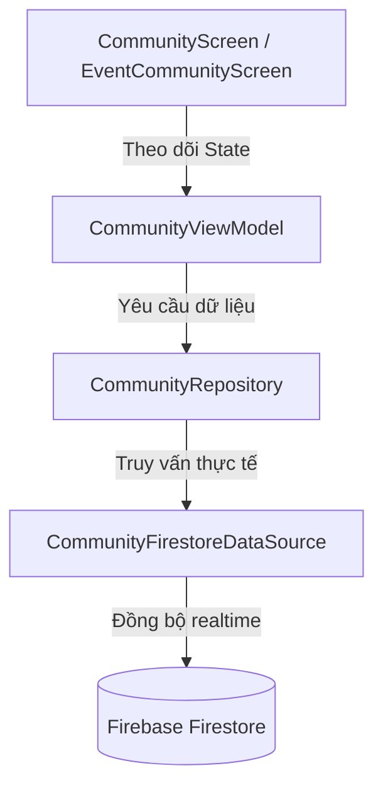
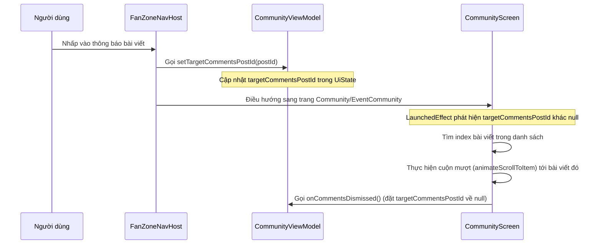

# Tài liệu Tính năng Cộng đồng (Community Feature Documentation)

Tài liệu này mô tả chi tiết kiến trúc, các thành phần UI, luồng xử lý dữ liệu và hệ thống thông báo của tính năng Cộng đồng (Community) trong ứng dụng FanZone.

---

## 1. Tổng quan (Overview)

Tính năng Cộng đồng cho phép người dùng:
- Xem dòng trạng thái các bài đăng nổi bật hoặc bài đăng thuộc về một sự kiện cụ thể.
- Chia sẻ cảm nghĩ, hình ảnh, bài hát.
- Thích (Like), bình luận (Comment), theo dõi (Follow) người dùng khác.
- Nhận thông báo tức thời (In-app & Local Device Notification) khi có tương tác mới.
- Điều hướng nhanh từ thông báo thẳng đến bài viết mục tiêu.

---

## 2. Kiến trúc & Các thành phần (Architecture & Components)

Tính năng được xây dựng theo mô hình MVVM (Model-View-ViewModel) kết hợp với Jetpack Compose và Firebase Firestore:

### A. Lớp Giao diện (UI Layer)
- **`CommunityScreen`**: Hiển thị bảng tin chung của cộng đồng, hỗ trợ giao diện co giãn (Responsive) trên màn hình lớn (Expanded Layout) và màn hình dọc điện thoại (Compact Layout).
- **`EventCommunityScreen`**: Hiển thị bảng tin riêng của từng sự kiện cụ thể (ví dụ: concert, trận đấu bóng đá) với Banner sự kiện ở trên đầu.
- **`CommunityCard`**: Component hiển thị thông tin bài đăng, ảnh đính kèm, lượt thích, số bình luận, nút chia sẻ và danh sách bình luận bên dưới.

### B. Lớp Xử lý Logic (ViewModel Layer)
- **`CommunityViewModel`**: 
  - Quản lý trạng thái giao diện (`CommunityUiState`), bao gồm danh sách bài viết (`posts`), bình luận theo từng bài viết (`commentsByPostId`), số thông báo chưa đọc (`unreadNotificationCount`).
  - Lắng nghe realtime các bài viết trên Firestore qua Listener.
  - Xử lý các thao tác Thích, Thêm/Xóa bài viết, Viết bình luận, Follow người dùng khác.

### C. Lớp Dữ liệu (Data Layer)
- **`CommunityRepository`** & **`CommunityFirestoreDataSource`**: Thực hiện các truy vấn đọc/ghi tài liệu bài đăng, lượt thích, bình luận và theo dõi trên Firestore Database.

---

## 3. Quy trình điều hướng & Cuộn tự động (Navigation & Auto-Scroll Flow)

Khi người dùng nhấn vào một thông báo liên quan đến một bài viết cụ thể:

- **Lợi ích**: Giúp người dùng tập trung trực tiếp vào nội dung bài đăng được tương tác mà không bị che khuất bởi hộp thoại bình luận tự động mở như trước.

---

## 4. Hệ thống Thông báo (Notification System)

Hệ thống thông báo của ứng dụng FanZone hoạt động thông qua hai hình thức song song:

### A. Thông báo trong ứng dụng (In-App Notifications)
- **Chấm đỏ báo hiệu (Red Dot Badge)**: Trên thanh tiêu đề của trang Cộng đồng, Cộng đồng Sự kiện và Cá nhân, nút hình chuông hiển thị một dấu chấm đỏ kích thước `10.dp` góc trên bên phải khi có thông báo chưa đọc (`unreadNotificationCount > 0`). Số lượng số cụ thể đã được lược bỏ để giao diện thanh lịch và tối giản hơn.
- **Trang Danh sách**: Hiển thị các hành động Thích, Bình luận, Theo dõi kèm ảnh đại diện và tên người gửi tương tác.

### B. Thông báo trên thiết bị (Local Device Notifications)
Khi có người dùng tương tác, ứng dụng sẽ đẩy một biểu ngữ thông báo (System Notification Banner) lên điện thoại của bạn kể cả khi ứng dụng đang chạy ngầm.

- **`NotificationHelper`**: 
  - Tạo một kênh thông báo (Notification Channel) với độ ưu tiên cao (`IMPORTANCE_HIGH`) tên là `FanZone Notifications`.
  - Sử dụng biểu tượng cục bộ của ứng dụng (`R.mipmap.ic_launcher`) làm biểu tượng nhỏ (Small Icon) để đảm bảo hiển thị đồng bộ và tránh lỗi hiển thị trên một số hệ điều hành tùy biến (như MIUI, OneUI).
  - Quản lý danh sách ID thông báo đã hiển thị (`displayedNotificationIds`) để **chỉ báo chuông/rung cho những thông báo mới phát sinh** khi bạn đang online, tránh làm phiền thiết bị bằng một loạt thông báo cũ khi vừa đăng nhập.
  - Hàm `reset()` sẽ được gọi để giải phóng bộ nhớ lưu trữ đệm này khi người dùng đăng xuất.

---

## 5. Phân quyền thiết bị (Device Permissions)

Để gửi thông báo trên điện thoại, ứng dụng xử lý linh hoạt theo phiên bản hệ điều hành Android:

### Android 12 trở xuống (Bao gồm Android 11)
- Thông báo được **tự động cấp quyền mặc định** ngay khi người dùng cài đặt ứng dụng.
- Ứng dụng sẽ trực tiếp gửi thông báo dạng banner mà không cần yêu cầu người dùng thao tác cấp quyền.

### Android 13 trở lên (API 33+)
- Ứng dụng khai báo quyền `<uses-permission android:name="android.permission.POST_NOTIFICATIONS" />` trong `AndroidManifest.xml`.
- Tại thời điểm khởi chạy ứng dụng (`MainActivity.onCreate`), hệ thống sẽ kiểm tra quyền này. Nếu chưa được cấp, ứng dụng sẽ kích hoạt hộp thoại hệ thống yêu cầu người dùng xác nhận **Cho phép** (Allow).

---

## 6. Kiểm tra & Khắc phục sự cố (Troubleshooting)

Nếu bạn không nhận được thông báo trên điện thoại khi thử nghiệm, hãy kiểm tra các điểm sau:

1. **Kiểm tra Cài đặt thiết bị**:
   - Truy cập **Cài đặt hệ điều hành Android** -> **Ứng dụng** -> **FanZone** -> **Thông báo**. Đảm bảo tùy chọn này đang ở trạng thái **Bật (Allowed)**.
2. **Quy tắc tự tương tác**:
   - Hệ thống sẽ không bắn thông báo nếu bạn tự Thích hoặc tự Bình luận trên bài đăng của chính mình. Hãy dùng một tài khoản khác để tương tác và thử nghiệm.
3. **Firestore Security Rules**:
   - Đảm bảo cơ sở dữ liệu Firebase của bạn đã cấp quyền ghi (`allow create`) và đọc (`allow read`) cho tài liệu trong bộ sưu tập `notifications`.
